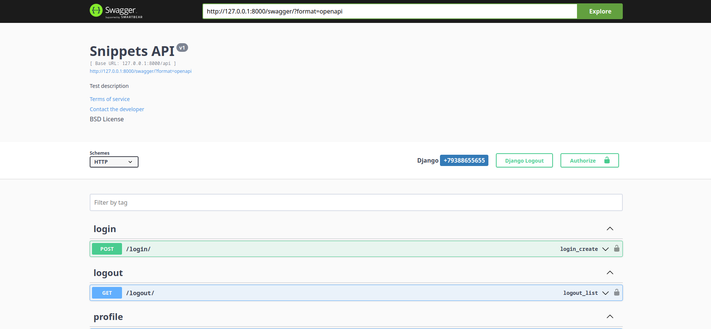

# Тестовое задание Hammer System

### "Залить в сеть, чтобы удобнее было тестировать(например бесплатно на https://www.pythonanywhere.com или heroku)" Не получится выполнить, на бесплатной лицензии только проекты менее 100мб. Сам проект, работающий в dockere занимает более 2 Гб.


### Cтек технологий:
* Python
* Django
* Django REST Framework
* PostgreSQL
* Docker
* Celery
* Redis

# Установка

### Скопируйте проект.
  
```console
git clone https://github.com/NaiNaniNai/electronic-shop-site.git
```

### Настройте проект.
 * Создайте .env файл
 * Скопируйте содержимое .env_example в созданный файл:
 ```console
  cat .env_example > .env
 ```
 * Установите переменные в этом файле:
    * `DB_HOST=` <- Хост для БД
    * `DB_NAME=` <- Название БД
    * `DB_USER=` <- Имя пользователя БД
    * `DB_PASSWORD` <- Пароль пользователя БД
    * `DEBUG=` <- Дебаг режим
    * `SECRET_KEY=` <- Секретный ключ проекта

##### Если вы хотите использовать другую базу данных воспользуйтесь [официальной документацией Django](https://docs.djangoproject.com/en/5.0/ref/settings/#databases).
  * Выполните команду по сборке образа:
    ```console
    docker-compose build
    ```
  * Добавьте супер пользователя (администратора) Django, выполнив следующую команду:
    ```console
    docker-compose run --rm web sh -c "poetry run python manage.py createsuperuser"
    ```
### Запустите проект
  * Используйте команду:
    ```console
    docker-compose up
    ```

# Документация API
### В проекте используется автодокументация Swagger.
### Описание API:
* Авторизация (POST метод):
  * Происходит по url: domain/api/login/. Требует обязательное поле phone. 
  ```json
    {"phone": "+номер телефона из 11 символов"}
  ```
  * Затем генерируется 4х значный код подтверждения и токен. Это кэшируется с помощью Redis, где токен - ключ.
  * Генерируется ссылка подтверждения номера телефона
* Подтверждение авторизации(POST метод):
  * Происходит по url: domain/api/verify/{token}/, где token - ключ из кэша пользователя в Redis. Требует обязательное поле confirm_code
  ```json
    {"confirm_code": "4-значное число"}
  ```
  * Если код подтверждения в кэше и отправленное пользователем совпадает, то пользователь проходит аутентификацию.
  
* Выход из аккаунта(GET метод)
  * Происходит по url: domain/api/logout/. Пользователь выходит из системы
* Профиль (GET метод)
  * Происходит по url: domain/api/profile/. Получает ответ от сервера.
  ```json
  {
    "id": 4,
    "phone": "+79999999999",
    "used_referral_code": "bl4lKs",
    "invite_referral_code": "Trb7wu",
    "referred_users": [
        "+79388655111"
    ]
  }
* Профиль (POST метод)
  * Происходит по url: domain/api/profile/. Требует обязательное поле used_referral_code. Если у пользователя уже есть код, то нельзя его поменять.
  Пользователь также не может ввести свой же код. Если оба условия соблюдены, то пользователь добавляет код автора.
